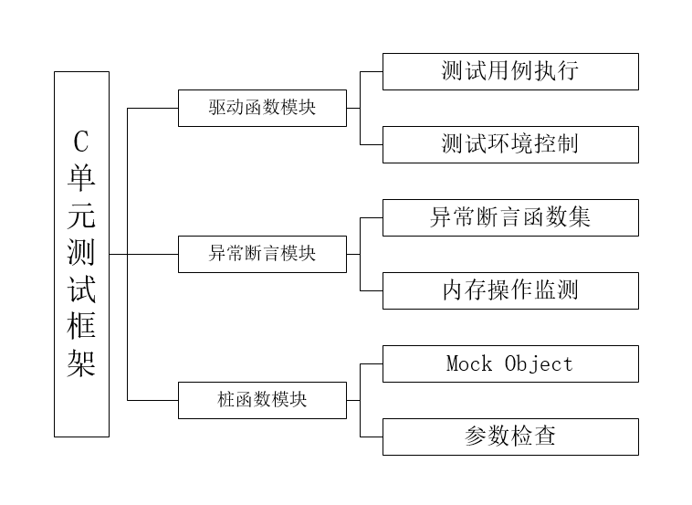
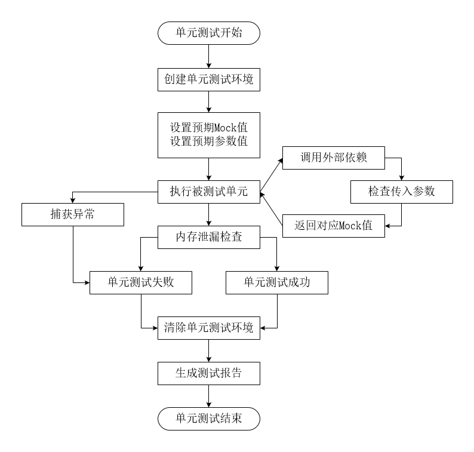
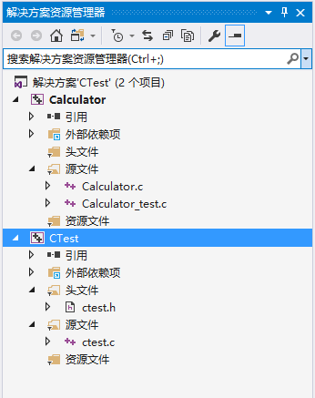
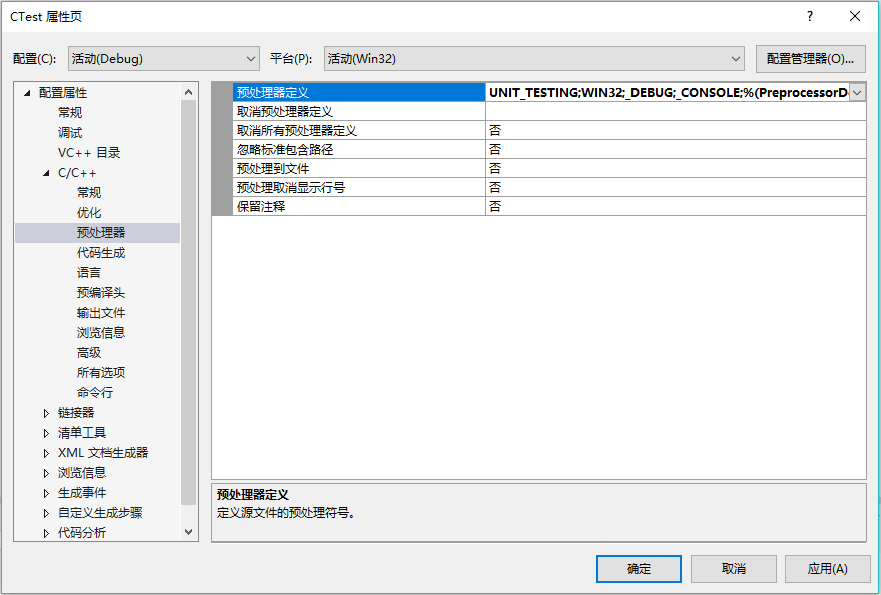
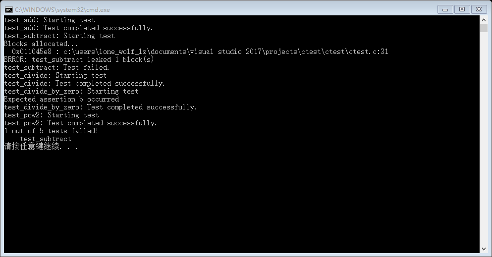
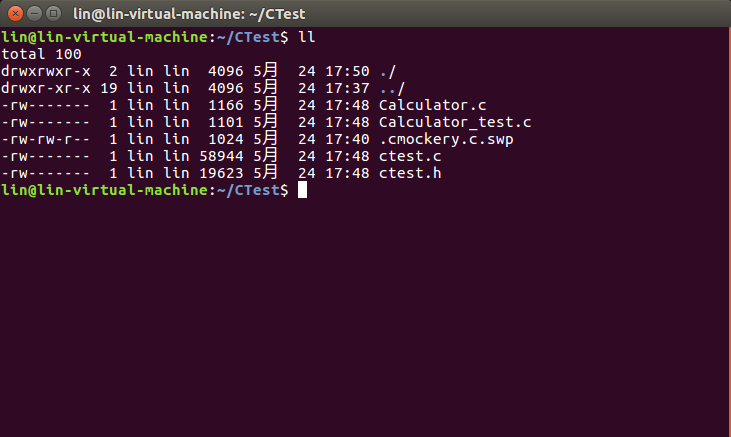
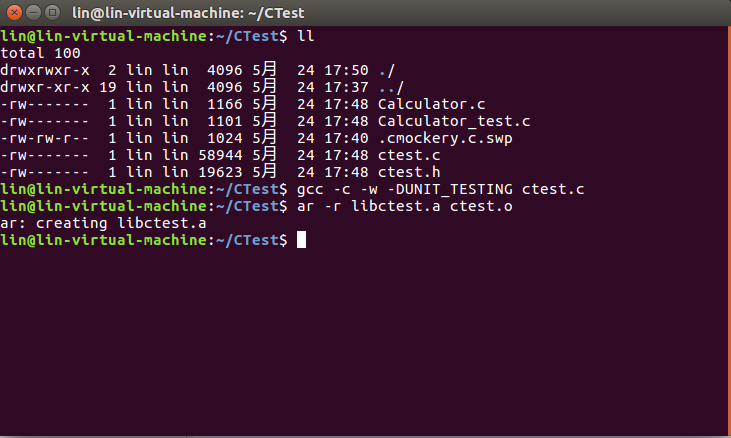
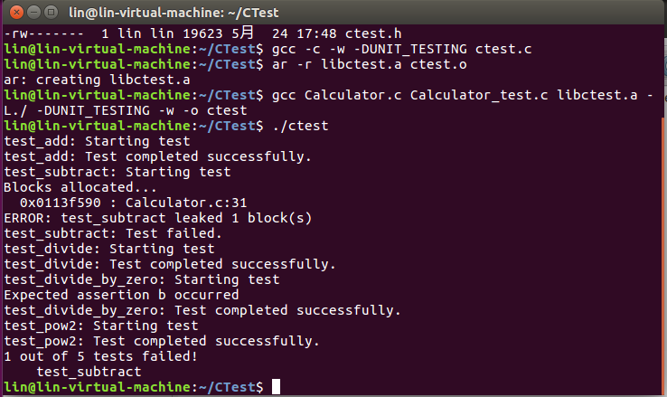

# 1 绪论

## 1.1 课题的目的（课题研究意义）

软件测试伴随着软件的产生而产生。而随着软件工程的发展，人们对软件的质量、性能和可靠性上提出更高要求。软件测试已然成为软件产品成功的先决条件，是软件开发的重要环节和软件质量的关键保证。1996年，欧洲阿丽亚娜发射升空39秒后爆炸；1999年，NASA的火星气候轨道探测器坠毁于火星上空；2000年，“千年虫”漏洞爆发，尽管已提前花费数亿资金用于修补漏洞，仍造成世界多地电子产品瘫痪。因此提高程序稳定性和正确性对软件工程产业的发展及减少不必要的经济损失尤为重要。

软件测试过程包含：单元测试，集成测试，确认测试和系统测试。随着软件产业的发展，一个软件项目动辄数百万行的代码，一次编译需要数十分钟，集成测试的代价大大增加。而单元测试则以其创建简单，维护容易，代价极低的优势逐渐显现出它的威力。

单元测试起源于传统的结构化编程时代，是针对程序模块（软件设计的最小单元）进行正确性验证。在面向过程编程中，程序单元就是单个程序、函数或过程。在面向对象编程中，最小单元就是方法。单元测试针对具体对象，可以对某个单元进行针对性的功能测试。

最早的单元测试框架是JUnit，由极限编程和测试驱动开发的创始人Kent Back以及Eclipse架构师之一、设计模式之父Erich Gamma共同开发。JUnit的推出，标志着单元测试迈入一个新的时代。在JUnit推出之后，各类xUnit框架如雨后春笋般涌出。如，为C++开发的CppUnit，为PHP开发的PHPUnit。这让各种xUnit单元测试框架不再是新鲜事物，然而在“古老”的C语言领域，还尚未有哪种单元框架可以成为“寡头”。

随着代码量的不断膨胀，数十分钟完成一次编译的现状，结构化编程方式的流行，迫使程序员对单元测试认识度和需求的日益提升，基于框架的单元测试也逐渐在流行开来。美国质量保证研究院对软件测试的研究结果表明：在整个软件开发周期中，错误发现得越早，软件的开发和维护成本就越低。单元测试是测试周期中的第一步，在这一阶段中发现的问题越多，对程序员进行软件开发越有利。

据2014年中国软件开发者报告称，C语言在开发者的第一编程语言排行中位居第四位。面对使用范围依然十分广泛的C语言，基于“将所需测试的模块通过打桩的方法实施单元测试”这一基本原理，设计和实现C语言环境下的单元测试框架具有重要的现实意义。

## 1.2 国内外研究现状和发展趋势

在自动化测试技术成熟之前，程序员依旧需要测试，能否编写优秀的模块，体现的是能力，而为代码编写完善的测试用例，体现的则是习惯。虽然测试并不能说明什么问题，但目前程序员并无任何备选方案，在很长一段时间内，完善的测试用例对于项目开发而言都是弥足珍贵的。有些时候程序员会觉得编写测试用例太烦，但是要知道，至少还能通过测试用例来进行测试，有很多领域是无法通过如此“傻瓜式”的测试来达成目的的。

在软件测试的整一体系当中，单元测试是由程序员自己来完成，最终受益的也是将是程序员自己。可以这么说，程序员有责任编写功能代码，同时也就有责任为自己的代码编写单元测试。执行单元测试，就是为了证明这段代码的行为和期望的一致。

现在，在软件产业发达的国家，软件测试已经在整个软件工程产业中占据了一个很大的比重。在享誉全球的微软公司中，开发工程师与测试工程师的比例达到了1：2。然而，我国在软件测试的发展上处于落后地位，许多软件公司轻视软件测试的作用。往往在项目开发完成后，才发现软件有严重缺陷，不得不推倒重来，从而造成了巨大损失，令人遗憾。即使在某些强制要求进行单元测试的单位中，程序员往往在代码编写完成后，再通过阅读代码来编写单元测试用例。这样的测试用例仅仅能够证明代码是做什么的，只能说明编译器能够正常使用，而不能正确的对代码单元进行测试，违背了测试驱动开发及驱动先行等理念。

早期单元测试往往在一个main函数里生成被测试类的一个实例对象并在main函数中实现了各个测试用例，每个测试用例则通过生成的被测试类实例对象调用被测试方法。执行测试时，则编译main函数所在的主文件，然后由控制台程序完成单元测试。但这一测试框架存在许多缺点。

- 测试用例结构混乱，若要单独执行某一测试用例，必须注释掉其余测试用例。

- 测试用例未能隔离外部测试环境，极可能受外部环境影响。

- 测试代码混乱，难以重构，无法复用，造成大量重复开发工作。

由于早期单元测试框架存在这些问题，单元测试在实际开发当中具有较大的局限性，在软件测试中的地位稍显尴尬。这一尴尬情况直到Kent Back与Erich Gamma共同推出JUnit这一Java单元测试框架后才发生转变。JUnit成为单元测试框架开发的标准，单元测试也迅速成为软件测试中重要的环节。依据JUnit测试框架的设计思想，其他语言的程序员也相继开发了针对各自语言的单元测试框架。一时之间，xUnit单元测试框架如雨后春笋般相继出现。有为高级语言C++而开发的CppUnit，也有为脚本语言PHP开发的PHPUnit，还有进行.Net单元测试的NUnit。

基于JUnit测试框架的设计思想的xUnit测试框架共包含TestRunner、Test、TestResult、TestCase、TestSuite、TestFixture六个部分。
- TestCase：所有测试用例的父类，用户通过继承TestCase来编写自己所需的测试用例。
- TestSuite：若干个测试用例组合成的测试集合，提供suite功能管理TestCase派生出来的测试用例。
- TestRunner：单元测试框架中的驱动模块，定义了执行TestCase和TestSuite的规则，负责驱动单元测试用例的执行及测试结果的输出，简化了整个单元测试。
- Test：TestCase和TestSuite的父类，提供了开发的run()方法供TestRunner调用。
- TestFixture：提供创建测试环境的setup()和卸载测试环境的teardown()两个方法，保证了两个测试用例间相互独立。
- TestResult：用于搜集测试用例运行的结果，并形成测试报告。

在xUnit系列的测试框架中，Test派生出测试用例的父类TestCase和测试集合TestCase。而TestRunner则通过调用的Test类的run()方法来运行每一个测试用例。Assert类定义了一系列断言方法，并在测试用例中被实例化为Assert对象以输出测试用例的运行结果。TestResult类则将运行结果收集形成测试报告。在这个测试框架当中，各个测试类犹如搭积木般层次分明。各个测试用例之间完全相互独立，每个测试用例都有各自的创建测试环境、准备测试数据、运行测试和卸载测试环境的过程。这使得每个测试用例都能独立运行，从而解决了早期单元测试框架中测试用例结构混乱无法重构等问题。

然而，C语言的抽象层次较低，没有类，派生和继承等语义，无法基于JUnit测试框架设计思想直接开发CUnit。但C语言作为传统的结构化语言，进行测试的单元一般是函数而非Java中的类。因此，虽然不能一味的照搬JUnit测试框架的设计思想，但其中的某些设计思想，如Mock，TestCase，TestFixture等，对C单元测试框架的开发极具参考价值。

Mock机制通常是指，在对对象A进行单元测试时，通过构造Mock对象来模拟外部对象与对象A之间的交互，而这些Mock对象的行为是我们事先设定且符合预期需求。这一机制的首次面世是在2000年Tim Mackinnon，Stere Freeman和Philip Craig的一篇名为“Endo-Testing：Unit Testing with mock object”的文章上介绍的使用仿造的方法调用来实现对对象的隔离。这一机制也让Java unit test的覆盖率提高到95%，C++的单元测试覆盖率提高到80%以上。

Mock Object机制的使用能够带来一些好处：1）避免其他模块出错引起本模块的测试错误。2）无需等待驱动模块和桩模块完成开发便可进行单元测试。3）快速返回所需数据，无需等待运行速度较慢的模块的返回值。

在Java和C++上实现Mock Object机制一般是从目标类中派生出Mock类，在派生的Mock类中覆盖被测试类对象所需的目标类的方法。当被测试对象调用目标类的方法时，由Mock类代替目标类返回。但C语言的抽象层次较低，没有类，派生和继承等语义，没有派生Mock类的寄生类，只依托宏来实现Mock机制。因此，Mock机制在许多语言的测试框架中都有支持，但在C语言中，支持Mock机制的测试框架少之又少。在Cgreen这个C Unit test framework中虽然支持Mock机制，但却要求在被测试的函数接口中附加一个stub参数，这样具有“侵入性”的设计令人倍感别扭。而且，对于系统接口和第三方库接口，无法改变其接口原型，这一方法便显得无能为力了。

综上，尽管C单元测试框架并非新奇产品，然而伴随程序员对C语言环境下单元测试的强烈需求，量身定制C单元测试框架将有助于提高程序代码质量和测试效率。

## 1.3 拟解决的关键问题

### 1.3.1 外部依赖问题

在单元测试中，被测试函数往往需要调用外部依赖来完成程序。而理想的单元测试环境则要求将被测单元与外部依赖进行隔离。这是由于外部依赖的正确性未能得到验证，需要防止外部依赖的错误引起本模块的测试错误；另外，某些外部请求运行速度较慢，严重影响被测试单元运行速度。因此，对于外部依赖，应采用桩函数或Mock机制予以代替，从而实现理想的测试环境。
### 1.3.2 异常断言问题

C语言仅仅在assert.h文件中提供了表达式断言assert()，使用assert()断言时，测试开发人员需要对表达式进行设计。而且当assert()函数断言到异常时，将中断整个程序的执行。但在单元测试中，用户需要丰富的断言类型，而且如果assert()函数产生了中断，后续的测试用例将无法继续执行！因此，在单元测试当中，需要替换掉原本的assert()函数，并为测试用例的编写提供更多assert()函数，如assert_int_equal()、assert_in_range()等。

### 1.3.3 内存操作问题

在C语言开发中，内存操作是C语言程序员的一柄双刃剑。程序员对它可谓是爱恨交织。一方面，内存操作给程序员带来了极大的编程自由；另一方面，内存操作也引入了内存泄露、内存越界等一系列问题。然而，内存问题一般难以察觉，尤其是内存泄漏问题。在数万行的大型项目代码中，出现内存泄漏问题的概率几乎100%，而这最终将导致软件在长期运行后产生系统内存耗尽或系统崩溃问题，影响软件的稳定性。因此，C语言迫切需要引入动态内存检查机制，以期在单元测试中及早发现内存问题。

## 1.4 论文组织结构

本系统严格按照软件工程的开发流程进行开发，本论文共有七章，其主要内容汇总如下。
第一章：根据国内外现状和发展趋势，提出了开发C单元测试框架的目标并论证了开发的必要性。接着，从技术上和开发环境上分析了开发的可行性。  
第二章：重点介绍了C单元测试框架开发过程中运用到的开发环境和开发工具的特点。  
第三章：对C单元测试框架的开发进行了简单的软件需求分析。  
第四章：详细阐述了C单元测试框架的模块结构设计及其业务流程设计。  
第五章：从代码的组织结构上详细叙述了C单元测试框架的实现过程，对第一章中提出的拟解决的关键问题设计出相应解决方案，对关键功能的实现给出了相应的实现代码。  
第六章：对系统的开发成果进行展示，按照功能叙述了软件的操作流程。  

# 2 系统开发工具及相关技术

著名IT技术问答网站StackOverflow每年都会进行一次开发者用户调查，并据此发布开发者调查报告。根据最新2016年开发者调查报告显示，Windows平台和类Unix平台（Linux和Mac OS X）已经成为99.9%以上的程序员选择的开发平台，而前三年的调查中的Other选项已经消失了。因此，C单元测试框架需要针对Windows平台和类Unix平台进行开发，以满足C语言程序员的测试开发需求。
为了在Windows平台和类Unix平台上进行开发，需要分别构建所需开发环境。在Windows平台上，以最新的Windows 10系统为开发平台，采用Visual Studio Community 2017作为IDE进行开发。而在类Unix平台上，则选择使用Linux内核的Ubuntu 16.04系统为开发平台，使用GNU工具链进行编译开发。

## 2.1 C语言

C语言是国际上使用最广泛的计算机高级语言之一。在TIOBE于2017年一月份发布的热度排行榜上，C语言以牢牢占据着第二位。作为最受欢迎的编程语言之一，C语言具有以下特点。

- C语言更接近底层硬件，可以直接对内存甚至硬件进行操作。
- C语言是一种结构化语言，很容易实模块化编程。模块化编程是指将程序功能进行分解，以功能块为单位进行编程，具有多人同时编程，设计简单易维护等优点。
- C语言具有较高的可移植性。C程序基本无需修改，就可以在不同的硬件平台和操作系统上运行。

基于上述特点，C语言成为底层开发的利器，在诸多邻域，如系统内核、数字计算，有着无可比拟的优势。因此，为C语言程序员的开发工作提供单元测试支持具有积极意义。而单元测试框架本身具有侵入性，因此，只能使用C语言进行C单元测试框架的开发。

## 2.2 Windows 10操作系统

Windows 10是微软发布的最后一个独立Windows版本，于2015年7月发布。据StackOverflow发布的2016年开发者调查报告显示，Windows 10发布一年后成为全球20.8%的开发者选择的操作系统。显然，Windows 10已经占领了很大一部分的开发者市场，而这归功于Windows 10的一些新特性，如Ubuntu子系统。Windows 10的新特性Ubuntu子系统允许开发者在Windows 10中添加一个Ubuntu子系统，并从Shell中启动bash，甚至两个系统可以互相调用对方的应用。这一特性使得开发者在Windows 10下也可以使用Linux系统，极大的解决了开发者在Windows平台和Liunx平台的选择问题。

## 2.3 Visual Studio 2017

Visual Studio 2017是微软最新的Visual Studio 版本，于2017年3月正式发布，是迄今为止最具生产力的Visual Studio版本。该版本不仅添加了实时单元测试、实时架构依赖关系验证等新特性，还对许多实用功能进行了改进，如代码导航、IntelliSense、重构、代码修复和调试等等。无论使用哪种语言或平台，都能节省开发者在日常任务上花费的时间和精力。此外，该版本还带来了一个新的轻量化和模块化的安装体验，可根据需要量身定制安装。多个增强功能汇集在一起，使 Visual Studio 2017 的启动速度比 Visual Studio 2015 快3倍，解决方案加载时间缩短 2-4倍。Visual Studio 2017的具体亮点如下：
- 导航增强：Visual Studio 2017 极大地改善了代码导航，并对结果进行着色，提供自定义分组、排序、过滤和搜索。强大的 Go to All（ctrl + T 或 ctrl +，），能对解决方案中的任何文件、类型、成员或符号声明的快速、完整搜索。
- 无须解决方案加载文件：Visual Studio 2017 可以直接打开并处理 C＃、 C ++ 、 Ruby 、 Go 等一系列语言的任何文件。
- 智能过滤：IntelliSense 现在提供过滤器，帮助得到你所需要的，而不必涉足过多的步骤。
- 语言改进：添加了新的 C＃ 语言重构命令，帮助将代码以最新标准现代化。新的风格分析器和对 EditorConfig 的支持能够协调整个团队的编码标准。
- CMake support for C++：可以通过在 Visual Studio 中直接加载 CMake 项目来开始编码。
- Linux support for C++： Visual C ++ for Linux 开发现在是 Visual Studio 2017 的一部分。
- Live unit testing：顾名思义，实时告诉你单元测试将通过或失败，而不用离开代码编辑器。
- Run to Click： 当在调试器中停止在某个中断状态时，将鼠标悬停在一行代码上，你会看到 Run to Click glyph。单击可在该行停止并下次继续以此执行。
- Exception Helpers：可立即查看异常的根本原因，即时访问内部异常。此外，可以在抛出异常停止时通过单击复选框添加条件来排除从指定模块抛出的异常类型。
- 小而轻的安装：Visual Studio 2017 新的安装程序更容易启动和运行。最小安装只有以前版本的十分之一大小，只需一两分钟即可完成安装。

## 2.4 Linux开发环境

Linux是一个现在非常流行的操作系统，广泛地应用于桌面个人电脑，嵌入式设备，如手机，平板电脑，路由器，电视和电子游戏机等。据Statista公布的数据，截止至2016第二季度，基于Linux内核的安卓平台已占有86.2%的手机市场成为移动端操作系统的霸主。而在服务器，大型主机和超级计算机上，也有着出色的表现。世界上500个最快的超级计算机，90%以上运行着Linux发行版或变种，最快的前10名超级电脑一致选择了基于Linux内核的操作系统。而Linux拥有这一地位的根源在于它的开源性以及高性能上。在Linux上，开源意味着可定制，免费以及大量的开源项目。且Linux是由C实现的，在性能上具有无可比拟的优势。

与此同时，Linux平台独有的开发者生态圈令开发者欲罢不能。在Linux平台开源，高效，安全成了它的代名词。各种开发相关工具，如Git、Vim、Shell、Pacman等，在Linux获取及其方便、轻松，仅需一行命令。因此，Linux成为类Unix平台中程序员的重要选择。

## 2.5 Ubuntu操作系统

根据Eclipse社区和Stack Overflow的调查：Ubuntu是开发者选择最多的Linux平台环境。这不仅在于Ubuntu本身由Linux系统带来的开发者生态圈，而且得力于它对开发者和企业特有的支持。轻量级的Ubuntu不仅可以在服务器，PC或者Mac上运行，而且在VM虚拟机中运行也有着出色的表现。而作为服务器和PC均能可的系统，它在部署上极其方便，快捷！

## 2.6 GNU工具链

GNU工具链是一个包含了由GNU计划所产生的各种编程工具的集合，由自由软件基金会负责维护工作，是Linux平台下开发的重要工具。这些工具形成了一条工具链，用于开发应用程序和操作系统。GNU工具链在针对嵌入式系统的Linux内核、BSD及其它软件的开发中起着至关重要的作用。

# 3 系统需求分析

系统需求分析是软件开发中的重要环节之一，需求分析能够发现软件中存在的一些隐藏需求。软件系统将对软件设计环节产生重要影响，有助于减少系统设计中的不合理性，排除系统设计中存在的隐患，增加代码的鲁棒性和可重用性，从而降低系统后期维护成本。因此，对软件系统进行需求分析将具有现实意义。

## 3.1 用户需求分析

本文的C语言单元测试框架主要为C语言测试开发人员提供了一套C语言单元测试代码编写框架。C语言测试开发人员利用本单元测试框架将能迅速为待测试的C语言单元代码编写测试代码，从而实现敏捷开发，测试驱动开发。为满足C语言测试开发人员在开发中对待测试单元代码进行修改甚至重构后仍能有效的利用已有的单元测试代码这一需求，测试代码应当可以适应变更，具有一定的可扩展性以及移植性。而许多C语言程序员从事底层开发工作，系统环境具有局限性，因此测试代码不应依赖过多的外部库，甚至仅仅依赖于C语言的标准库。同时，还有许多旧编译器，如Turbo C，未实现新型编译技术或C语言的新标准的新特性，而现在主流的支持新标准的编译器取消了对旧标准中被删去的特性的支持。因此，测试代码应当兼容旧标准，尽可能的兼容ANSI C (C89)，避开C99和C11中的新特性和删除的旧特性。此外，对于C语言程序员烦恼的内存操作问题、异常断言问题、参数检查问题提供必要的支持。综上所述，本C语言单元测试框架的用户需求如下：
- 测试用例代码结构清晰，易扩展，可移植。
- 测试框架仅依赖标准库
- 兼容新旧C语言标准
- 支持内存检测，参数检查
- 隔离待测试单元的外部环境


## 3.2 功能需求分析

单元测试，又称为模块测试，即指对程序模块（软件设计中最小单元）来进行正确性的检查和验证。在理想条件下的单元测试用例独立于其他测试用例。为达成单元测试的理想状态，在单元测试时，需要为每个测试用例各自创建一个隔离外部依赖的测试环境。此外，在单元测试中引入单元测试框架，这使得测试开发人员不需要再关注于驱动单元测试用例的执行过程、测试结果的收集过程以及测试用例集合管理工作，仅仅需要关注测试用例的编写工作。这便要求单元测试框架代替测试开发人员完成上述工作，甚至在单元测试框架提供丰富的断言集及公用方法，使得编写单个单元测试用例的工作得到最大化的简化，提高测试开发人员的工作效率。除了简化单元测试用例的编写外，还需要简化桩函数的编写。桩函数是为了代替外部调用函数而编写的。然而，在传统单元测试中，编写桩函数费时费力，甚至可能编写一个桩函数的工作相当于原函数的实现。所以，简化桩函数的编写工作势在必行。综上所述，根据用户实际需求，结合单元测试需求，本单元测试框架的功能需求如下：
- 每个测试用例相互独立，具有各自的创建测试环境、准备测试数据、运行测试和卸载测试环境的过程。多个测试用例灵活使用，既可单个测试用例各自单独执行，亦能多个测试用例一起统一执行。
- 对内存操作进行跟踪并进行检测，在单元测试阶段针对内存泄露、内存越界等内存问题进行检查，帮助C语言程序员解决最为头疼的内存问题，避免在集成测试中由内存泄漏问题难以发现而造成巨大损失。
- 使用自定义的异常断言mock_assert()函数取代C语言标准库assert.h中的assert()函数，防止待测试单元中使用assert()函数进行断言导致单元测试未完成所有测试用例就中断运行。
- 提供丰富的断言集及公用方法用于简化单元测试用例的编写工作，提高测试开发人员的工作效率。
- 规范桩函数的编写，简化桩函数的编写工作。
- 实现C语言版的Mock Object机制，实现对外部依赖的隔离，同时也设置预期的外部依赖的返回值，满足测试开发人员对于在单元测试模拟任意环境模拟任意输入的需求。
- 对待测试单元调用桩函数时使用的参数进行检查，并与预期值进行验证，从而对待测试单元运行过程进行验证。
- 单元测试代码在Windows平台和类Unix平台下具有可移植性，因此，单元测试框架也需要具备在不同平台下适用性。
- 单元测试代码仅与标准C语言库链接，不需要额外包含特殊库。
- C语言单元测试框架兼容ANSI C (C89)标准，不依赖C99和C11中的新特性，同时也避开新标准中被删去的旧标准特性。

## 3.3 性能需求分析

为保证本单元测试框架具有广泛的适用性，为C语言测试开发人员提供稳定、可靠的单元测试功能，本单元测试框架需要满足如下性能需求：
- 作为一个单元测试框架，首先要保证自身系统的稳定性以及正确性。
- 为满足单元测试框架在底层开发中，面对内存空间较小，系统无动态库支持等性能上的局限性问题，需要在单元测试框架中减少内存空间占用。

## 3.4 开发环境需求分析

一个好的硬件环境可以使系统在运行或相应时更为流畅、迅速，有效的提高开发效率。一个好的软件开发环境也很重要，它能提高系统整体的开发效率。本单元测试框架需要在Windows平台及类Unix平台下进行开发，各平台下开发环境如下：

|平台|Windows平台|类Unix平台|
|---|---|---|
|系统|Windows 10|Ubuntu 16.04|
|文本编辑器|Visual Studio Community 2017|Atom|
|编译工具|MSBuild|GNU工具链|

# 4 系统设计

系统设计是C语言单元测试框架在开发时期的一个重要环节，它定义了软件系统的架构、组件、接口及其他特征过程。精妙的软件系统设计不仅能够增强系统的灵活性，还能降低软件的后期维护难度，保证后期的开发能够有条不紊地完成。
系统设计需要立足于需求分析，根据对测试开发人员的实际需求的分析与理解，从而进行设计。系统设计中建立的是系统的逻辑模型，其主要目的是为了充分了解系统模块组成，以及对每一个模块的流程进行详细规划，合理设计。

## 4.1 系统功能模块结构设计

本单元测试框架需要实现对待测试单元及对应的测试用例执行单元测试并输出单元测试报告。整个系统包括驱动函数模块，异常断言模块以及桩函数模块。系统启动后，由驱动函数模块控制各个测试用例依次执行创建测试环境、执行测试用例以及清除测试环境各个测试执行过程。而异常断言模块则在执行单元测试的过程中对被测试单元进行监听，捕获测试过程中出现的异常错误。此外，桩函数模块则在驱动函数模块执行创建测试环境后，根据测试用例创建被测试单元所需的Mock Object以及参数检查事件，从而实现C语言版Mock Object机制及参数检查机制。本单元测试框架整体系统功能模块图如下。



## 4.2 驱动函数模块

驱动函数模块是单元测试框架中的驱动模块，负责驱动单元测试用例的执行。整个驱动函数模块分为测试环境控制模块和测试用例执行模块。测试环境控制模块负责在单元测试前创建独立的单元测试环境并在单元测试结束后清除测试环境；而测试用例执行模块则负责调度及驱动各个测试用例的执行并最终生成测试报告。

## 4.3 异常断言模块

异常断言模块是单元测试框架中的测试模块，负责监听单元测试的执行并及时捕获执行过程中的错误异常。整个异常断言函数集模块由异常断言函数模块和内存操作监测模块两部分构成。异常断言函数集模块使用`mock_assert()`函数取代`assert()`函数并提供丰富的异常断言函数供测试开发人员编写测试用例，大大地简化了测试开发人员编写测试用例的难度。内存操作监测模块使用`test_malloc()`、`test_calloc()`和`test_free()`三个函数分别取代`malloc()`、`calloc()`和`free()`三个函数，从而跟踪并监测内存操作。此外，异常断言模块在单元测试执行时捕获产生的异常错误或者在清除测试环境时发现内存泄漏后会生成单元测试失败报告交与驱动函数模块生成最终的测试报告。

## 4.4 桩函数模块

桩函数模块是单元测试中的桩模块，负责单元测试对外部依赖的静态调用。整个桩模块实现了Mock Object及参数检查两大机制。Mock Object机制通过测试开发人员在测试用例中调用`will_return()`函数来设置桩函数预期返回的Mock值。而参数检查机制则通过测试开发人员在测试用例中调用`expect_*()`函数来设置参数预期传入的参数值。

## 4.5 系统流程设计

单元测试开始后，首先进行的是创建单元测试环境。随后，根据测试开发人员编写的测试用例，先加载并设置预期的Mock值和参数值以用于Mock Object和参数检查。在完成加载及设置工作后，再执行被测试单元并将结果与预期结果进行断言。在执行被测试单元的过程中，如果调用了外部依赖函数，则由桩函数模块对应的桩函数进行响应。对应的桩函数响应后，先对传入参数进行检查，再返回对应的Mock值。与此同时，异常断言模块对整个被测试单元的执行过程进行监听。如果异常断言模块捕获到任意异常，将转入单元测试失败处理。被测试单元执行完毕后，单元测试框架将对内存泄漏进行检查，如果产生内存泄漏则进入单元测试失败处理，否则进入单元测试成功处理。最终，在单元测试成功处理或者失败处理结束后，单元测试框架会清除单元测试环境，并生成单元测试报告，完成整个单元测试过程。本单元测试框架整体系统流程图如下。



# 5 系统实现

本单元测试框架局限于C语言较低的抽象性，因此只能依托于大量的宏定义来实现对待测试单元的监听和打桩。

## 5.1 系统整体设计实现

本单元测试框架主要模块有驱动函数模块、异常断言模块以及桩函数模块。除了这三大主要模块之外，本单元测试框架还需要完成以下功能模块。

- 执行测试用例时需要存储测试用例中设置的预期Mock值和参数值。
- 在动态内存操作管理时，需要动态管理待测试单元开辟的内存块。
- 单元测试结束后输出单元测试报告。

存储预期Mock值和参数值需要一个三元的表结构，这个表结构需要实现增加或删除目标节点以及查找目标节点等操作。考虑到没有要求测试开发任意在测试用例中依照调用顺序设置预期Mock值和参数值，所以，这个表结构需要实现动态删除操作。而动态内存操作则需要一个一元的表结构，这个表结构同样需要实现增加目标节点、动态删除目标节点以及查找目标节点等操作。如果使用链表结构来实现这两个所需的表结构，则链表的实现代码可以实现代码复用。因此，在综合考虑后，决定使用链表结构来存储预期Mock值、参数值、动态产生的内存块以及内存块信息。本单元测试框架中使用的链接结构及链表相关函数声明如下。

``` C
typedef struct ListNode {
	const void *value;
	int refcount;
	struct ListNode *next;
	struct ListNode *prev;
} ListNode;

static ListNode* list_initialize(ListNode * const node);
static ListNode* list_add(ListNode * const head, ListNode *new_node);
static ListNode* list_add_value(ListNode * const head, const void *value, const int count);
static ListNode* list_remove(ListNode * const node, const CleanupListValue cleanup_value, void * const cleanup_value_data);
static void list_remove_free(ListNode * const node, const CleanupListValue cleanup_value, void * const cleanup_value_data);
static int list_empty(const ListNode * const head);
static int list_find(ListNode * const head, const void *value, const EqualityFunction equal_func, ListNode **output);
static int list_first(ListNode * const head, ListNode **output);
static ListNode* list_free(ListNode * const head, const CleanupListValue cleanup_value, void * const cleanup_value_data);

static void add_symbol_value(ListNode * const symbol_map_head, const char * const symbol_names[], const size_t number_of_symbol_names, const void* value, const int count);
static int get_symbol_value(ListNode * const symbol_map_head, const char * const symbol_names[], const size_t number_of_symbol_names, void **output);
static void free_value(const void *value, void *cleanup_value_data);
static void free_symbol_map_value(const void *value, void *cleanup_value_data);
static void remove_always_return_values(ListNode * const map_head, const size_t number_of_symbol_names);
```

## 5.2 驱动函数模块的实现

驱动函数模块分为测试环境控制模块和测试用例执行模块。

### 5.2.1 测试环境控制模块的实现

测试环境控制模块主要由负责在单元测试前创建独立的单元测试环境的`setup_test(const char *test_name)`函数和负责在单元测试结束后清除测试环境的`teardown_testing(const char *test_name)`函数一起构成。在`setup_test(const char *test_name)`函数中，单元测试框架初始化了Mock值存储链表和参数值检查链表，该函数的具体实现如下。

``` C
void setup_test(const char *test_name) {
    list_initialize(&global_function_result_map_head);
    initialize_source_location(&global_last_mock_value_location);
    list_initialize(&global_function_parameter_map_head);
    initialize_source_location(&global_last_parameter_location);
}
```

而在`teardown_testing(const char *test_name)`函数中，单元测试框架释放了Mock值存储链表和参数值检查链表，该函数的具体的实现如下。

``` C
void teardown_testing(const char *test_name) {
	list_free(&global_function_result_map_head, free_symbol_map_value,(void*)0);
	initialize_source_location(&global_last_mock_value_location);
	list_free(&global_function_parameter_map_head, free_symbol_map_value,(void*)1);
	initialize_source_location(&global_last_parameter_location);
}
```

### 5.2.2 测试用例执行模块的实现

单元测试框架在`int _run_test(...)`函数中实现测试用例执行模块。在`int _run_test(...)`函数中，依次执行创建测试环境，执行测试用例，内存泄漏检查以及清除测试环境等工作。`int _run_test(...)`函数的部分实现如下。

``` C
int _run_test(const char * const function_name,  const UnitTestFunction Function, void ** const state, const UnitTestFunctionType function_type, const void* const heap_check_point) {
    const ListNode * const check_point = heap_check_point ? heap_check_point : check_point_allocated_blocks();
    void *current_state = NULL;
    int rc = 1;					// return rc;

    ...

    setup_test(function_name);                                  // 创建测试环境
    global_running_test = 1;                                    // 开始测试
    if (setjmp(global_run_test_env) == 0) {
        Function(state ? state : &current_state);               // 运行测试用例，进行测试
        fail_if_leftover_values(function_name);                 // 检查是否有未使用Mock值或者参数值
        fail_if_blocks_allocated(check_point, function_name);   // 内存泄漏检查
        global_running_test = 0;                                // 结束测试
        print_message("%s: Test completed successfully.\n", function_name);
        rc = 0;
    }
    else {
        global_running_test = 0;                                // 结束测试
        print_message("%s: Test failed.\n", function_name);
    }
    teardown_testing(function_name);                            // 清除测试环境

    ...

    return rc;
}
```

## 5.3 异常断言模块的实现

异常断言模块分为异常断言函数集模块和内存操作监测模块。

### 5.3.1 异常断言函数集模块的实现

异常断言函数集模块分为两个部分，第一部分是用于取代C语言标准头文件`assert.h`中`assert(expression)`函数的`mock_assert(const int result, const char* expression, const char *file, const int line)`函数；另一部分是供给测试开发人员编写测试用例使用的断言函数集`assert_*()`。

使用`mock_assert()`函数取代`assert()`函数需要在待测试单元的代码所在文件中加入以下预处理代码。

``` C
#if UNIT_TESTING
extern void mock_assert(const int result, const char* const expression, const char * const file, const int line);
#undef assert
#define assert(expression) mock_assert((int)(expression), #expression, __FILE__, __LINE__);
#endif // UNIT_TESTING
```

在以上预处理代码中，通过宏定义，将`assert()`重定义为`mock_assert()`，从而实现对`assert()`的取代。而`mock_assert()`的实现如下。

``` C
void mock_assert(const int result, const char* const expression, const char* const file, const int line) {
	if (!result) {
		if (global_expecting_assert) {
			longjmp(global_expect_assert_env, (int)expression);
		} else {
			print_error("ASSERT: %s\n", expression);
			_fail(file, line);
		}
	}
}
```

如果测试用例要测试`assert()`函数是否正确执行，则在测试用例中使用`expect_assert_failure(function)`编写测试用例，其中`function`为待测试函数。当测试用例触发`mock_assert()`函数后，`longjmp()`函数将跳转回测试用例`expect_assert_failure(function)`处。而如果测试用例意外触发`assert()`函数，则将输出异常信息，并中断测试。

另外，本单元测试框架提供了丰富的异常断言函数供测试开发人员使用。以下是本单元测试框架提供的异常断言函数集内函数的声明。

``` C
void assert_true(const int result, const char* const expression, const char * const file, const int line);
void assert_int_equal(const int a, const int b, const char * const file, const int line);
void assert_int_not_equal(const int a, const int b, const char * const file, const int line);
void assert_string_equal(const char * const a, const char * const b, const char * const file, const int line);
void assert_string_not_equal(const char * const a, const char * const b, const char *file, const int line);
void assert_memory_equal(const void * const a, const void * const b, const size_t size, const char* const file, const int line);
void assert_memory_not_equal(const void * const a, const void * const b, const size_t size, const char* const file, const int line);
void assert_in_range(const int value, const int minimum, const int maximum, const char* const file, const int line);
void assert_not_in_range(const int value, const int minimum, const int maximum, const char* const file, const int line);
void assert_in_set(const void * const value, const void *values[], const size_t number_of_values, const char* const file, const int line);
void assert_not_in_set(const void * const value, const void *values[], const size_t number_of_values, const char* const file, const int line);
```


### 5.3.2 内存操作监测模块的实现

内存操作监测模块以自定义的`test_malloc()`、`test_calloc()`和`test_free()`三个函数分别取代`malloc()`、`calloc()`和`free()`三个函数来实现对动态内存操作的监测。

使用内存操作监测模块需要在待测试单元的代码所在文件中加入以下预处理代码。

``` C
#if UNIT_TESTING
extern void* _test_malloc(const size_t size, const char* file, const int line);
extern void* _test_calloc(const size_t number_of_elements, const size_t size,  const char* file, const int line);
extern void _test_free(void* const ptr, const char* file, const int line);
#define malloc(size) _test_malloc(size, __FILE__, __LINE__)
#define calloc(num, size) _test_calloc(num, size, __FILE__, __LINE__)
#define free(ptr) _test_free(ptr, __FILE__, __LINE__)
#endif // UNIT_TESTING
```

在以上预处理代码中，通过宏定义，将自定义的`test_malloc()`、`test_calloc()`和`test_free()`三个函数分别取代`malloc()`、`calloc()`和`free()`三个函数，从而实现对内存操作的监测。在`test_malloc()`的实现中，先取消原本的宏定义，使用`malloc()`函数为内存块信息记录结构`MallocBlockInfo`和申请的内存块申请一块足够大的内存块空间。这块内存块的首部用于存放`MallocBlockInfo`结构，尾部用于存放申请的内存块。获得足够大的内存块后，计算出申请的内存块起始位置并在内存块前后填充标志字符。最后再将这块空间中首部初始化为`MallocBlockInfo`结构，并插入到内存块链表中。以下是`test_malloc()`的实现。

``` C
#undef malloc
void* _test_malloc(const size_t size, const char* file, const int line) {
    char* ptr;
    MallocBlockInfo *block_info;
    ListNode * const block_list = get_allocated_blocks_list();
    const size_t allocate_size = size + (MALLOC_GUARD_SIZE * 2) + sizeof(*block_info) + MALLOC_ALIGNMENT;
    char* const block = (char*)malloc(allocate_size);
    assert_true(block);
    // 计算申请的分配块的起始位置
    ptr = (char*)(((size_t)block + MALLOC_GUARD_SIZE + sizeof(*block_info) + MALLOC_ALIGNMENT) & ~(MALLOC_ALIGNMENT - 1));
    // 在内存块前后填充标志字符，初始化此内存块。
    memset(ptr - MALLOC_GUARD_SIZE, MALLOC_GUARD_PATTERN, MALLOC_GUARD_SIZE);
    memset(ptr + size, MALLOC_GUARD_PATTERN, MALLOC_GUARD_SIZE);
    memset(ptr, MALLOC_ALLOC_PATTERN, size);
    // 初始化MallocBlockInfo结构
    block_info = (MallocBlockInfo*)(ptr - (MALLOC_GUARD_SIZE + sizeof(*block_info)));
    set_source_location(&block_info->location, file, line);
    block_info->allocated_size = allocate_size;
    block_info->size = size;
    block_info->block = block;
    block_info->node.value = block_info;
    list_add(block_list, &block_info->node);
    return ptr;
}
#define malloc test_malloc
```

而在`test_free()`的实现中，先取消原本的宏定义，再进行内存越界检查，最后从内存块链表中删去这个节点，并释放该内存块。

``` C
#undef free
void _test_free(void* const ptr, const char* file, const int line) {
    unsigned int i;
    char *block = (char*)ptr;
    MallocBlockInfo *block_info;
    _assert_true((int)ptr, "ptr", file, line);
    block_info = (MallocBlockInfo*)(block - (MALLOC_GUARD_SIZE + sizeof(*block_info)));
    // 内存越界检查
    {
        char *guards[2] = {block - MALLOC_GUARD_SIZE, block + block_info->size};
        for (i = 0; i < ARRAY_LENGTH(guards); i++) {
            unsigned int j;
            char * const guard = guards[i];
            for (j = 0; j < MALLOC_GUARD_SIZE; j++) {
                const char diff = guard[j] - MALLOC_GUARD_PATTERN;
                if (diff) {
                    print_error(
                        "Guard block of 0x%08x size=%d allocated by "
                        SOURCE_LOCATION_FORMAT " at 0x%08x is corrupt\n",
                        (size_t)ptr, block_info->size,
                        block_info->location.file, block_info->location.line,
                        (size_t)&guard[j]);
                    _fail(file, line);
                }
            }
        }
    }
    list_remove(&block_info->node, NULL, NULL);
    block = block_info->block;
    memset(block, MALLOC_FREE_PATTERN, block_info->allocated_size);
    free(block);
}
#define free test_free
```

## 5.4 桩函数模块的实现

桩函数模块分为Mock Object机制和参数检查模块。使用单元测试框架后，桩函数的编写工作统一简化为调用参数检查函数和返回Mock函数两个部分，甚至可以交由自动编码器完成编写。

### 5.4.1 Mock Object机制的实现

Mock Object机制在于在测试用例中使用`will_return()`函数设置Mock值以及在桩函数中使用`mock()`返回对应的Mock值。在测试用例中，测试开发人员使用`will_return()`函数将桩函数的函数名及对应的Mock值添加到单元测试框架的Mock值链表中。`will_return()`函数的实现如下。

``` C
void will_return(const char * const function_name, const char * const file, const int line, const void* const value, const int count) {
    SymbolValue * const return_value = malloc(sizeof(*return_value));
    assert_true(count > 0);
    return_value->value = value;
    set_source_location(&return_value->location, file, line);
    add_symbol_value(&global_function_result_map_head, &function_name, 1, return_value, count);
}
```

设置完Mock值后，返回对应的Mock值就由`mock()`函数完成。在`mock()`函数中，先根据桩函数名在Mock值链表中获取对应的Mock值，再释放该链表节点并返回对应的Mock值。`mock()`函数的实现如下。

``` C
void* mock(const char * const function, const char* const file, const int line) {
	void *result;
	const int rc = get_symbol_value(&global_function_result_map_head, &function, 1, &result);
	if (rc) {
		SymbolValue * const symbol = result;
		void * const value = (void*)symbol->value;
		global_last_mock_value_location = symbol->location;
		if (rc == 1) {
			free(symbol);
		}
		return value;
	} else {
		print_error("ERROR: " SOURCE_LOCATION_FORMAT " - Could not get value to mock function %s\n", file, line, function);
		if (source_location_is_set(&global_last_mock_value_location)) {
			print_error("Previously returned mock value was declared at " SOURCE_LOCATION_FORMAT "\n",
			            global_last_mock_value_location.file,
			            global_last_mock_value_location.line);
		} else {
			print_error("There were no previously returned mock values for this test.\n");
		}
		exit_test(1);
	}
	return NULL;
}
```

完成`will_return()`和`mock()`这两个函数后，需要测试用例和桩函数中使用，下面是在一个桩函数`func()`和一个测试用例`test()`中的使用`will_return()`和`mock()`的示例。

``` C
int func() {
    return (int)mock();
}

void test(void **state) {
    will_return(func, 0);
}
```

### 5.4.2 参数检查模块的实现

参数检查模块的实现与Mock Object机制的实现采用同一思路。在测试用例中使用`expect_*()`函数设置参数值然后在桩函数中使用`check_expected()`对传入的参数值与对应的参数值进行比较。

本单元测试框架中，提供了一个`expect_*()`函数集供测试开发人员设置参数值。以下是本单元测试框架提供的`expect_*()`函数集中的函数的声明。

``` C
void expect_in_set(const char* const function, const char* const parameter, const char* const file, const int line, const void *values[], const size_t number_of_values, const int count);
void expect_not_in_set(const char* const function, const char* const parameter, const char* const file, const int line, const void *values[], const size_t number_of_values, const int count);

void expect_in_range(const char* const function, const char* const parameter, const char* const file, const int line, const int minimum, const int maximum, const int count);
void expect_not_in_range(const char* const function, const char* const parameter, const char* const file, const int line, const int minimum, const int maximum, const int count);
void expect_value(const char* const function, const char* const parameter, const char* const file, const int line, const void* const value, const int count);
void expect_not_value(const char* const function, const char* const parameter, const char* const file, const int line, const void* const value, const int count);
void expect_string(const char* const function, const char* const parameter, const char* const file, const int line, const char* string, const int count);
void expect_not_string(const char* const function, const char* const parameter, const char* const file, const int line, const char* string, const int count);
void expect_memory(const char* const function, const char* const parameter, const char* const file, const int line, const void* const memory, const size_t size, const int count);
void expect_not_memory(const char* const function, const char* const parameter, const char* const file, const int line, const void* const memory, const size_t size, const int count);
void expect_any(const char* const function, const char* const parameter, const char* const file, const int line, const int count);
```

测试开发人员调用上述函数在测试用例添加参数检查事件，在桩函数中触发参数检查事件则由`check_expected()`函数完成。在`check_expected()`函数，单元测试框架先在参数值链表中获取对应的参数值，然后与传入的参数值进行比较并删除链表中节点。

``` C
void check_expected(const char * const function_name, const char * const parameter_name, const char* file, const int line, const void* value) {
	void *result;// 存储参数检查事件
	const char* symbols[] = {function_name, parameter_name};
	// 获取设置的参数值，及参数检查事件
	const int rc = get_symbol_value(&global_function_parameter_map_head, symbols, 2, &result);
	if (!rc)
	{
		// 获取设置的参数值失败
		print_error("ERROR: " SOURCE_LOCATION_FORMAT " - Could not get value to check parameter %s of function %s\n", file, line,
		            parameter_name, function_name);
		if (source_location_is_set(&global_last_parameter_location)) {
			print_error("Previously declared parameter value was declared at " SOURCE_LOCATION_FORMAT "\n",
			            global_last_parameter_location.file,
			            global_last_parameter_location.line);
		} else {
			print_error("There were no previously declared parameter values for this test.\n");
		}
		exit_test(1);
	}

	// 获得设置的参数值成功
	CheckParameterEvent * const check = (CheckParameterEvent*)result;
	int check_succeeded;
	global_last_parameter_location = check->location;
	check_succeeded = check->check_value(value, check->check_value_data);
	if (rc == 1) {
		free(check);
	}
	if (!check_succeeded) {
		print_error("ERROR: Check of parameter %s, function %s failed\n"
			        "Expected parameter declared at "SOURCE_LOCATION_FORMAT "\n",
			        parameter_name, function_name,
			        global_last_parameter_location.file,
			        global_last_parameter_location.line);
		_fail(file, line);
	}
}
```

完成`expect_*()`函数集和`check_expected()`这个函数后，需要测试用例和桩函数中使用，下面是在一个桩函数`func()`和一个测试用例`expect_value()`中的使用`will_return()`和`check_expected()`的示例。

``` C
void func(type T) {
    check_expected(T)
    return ;
}

void test(void **state) {
    expect_value(func, T, 0);
}
```

# 6 系统展示

在实际开发当中，单元测试框架应当是在测试工作中长期持续使用的测试库。因此，在进行系统展示时模拟日常测试工作，先将单元测试框架编译为链接库供单元测试使用。然后再将编译完成的链接库作为外部引用链接到测试程序当中。

## 6.1 待测试单元代码

为演示本单元测试框架的功能，故编写一些待测试单元用于演示。

``` C
#include <assert.h>
#include <malloc.h>
#include <stdio.h>
#include <stdlib.h>
#include <string.h>

#if UNIT_TESTING
extern void mock_assert(const int result, const char* const expression, const char * const file, const int line);
#undef assert
#define assert(expression) mock_assert((int)(expression), #expression, __FILE__, __LINE__);

extern void* _test_malloc(const size_t size, const char* file, const int line);
extern void* _test_calloc(const size_t number_of_elements, const size_t size,  const char* file, const int line);
extern void _test_free(void* const ptr, const char* file, const int line);
#define malloc(size) _test_malloc(size, __FILE__, __LINE__)
#define calloc(num, size) _test_calloc(num, size, __FILE__, __LINE__)
#define free(ptr) _test_free(ptr, __FILE__, __LINE__)
#endif

int add(int a, int b);
int subtract(int a, int b);
extern int multiply(int a, int b);
int divide(int a, int b);
int pow2(int a);

int add(int a, int b) {
	return a + b;
}

int subtract(int a, int b) {
	int * ret = malloc(sizeof(int));
	*ret = a - b;
	return *ret;
}

int divide(int a, int b) {
	assert(b);
	return a / b;
}

int pow2(int a) {
	return multiply(a, a);
}
```

在上方代码中，`add()`函数实现了一个加法器，`subtract()`函数实现了一个存在内存泄漏问题的减法器，`divide()`函数实现了一个对除数进行断言的除法器，`pow2()`函数调用外部乘法函数`extern int multiply()`实现了一个平方计算器。

## 6.2 单元测试代码

为对上方待测试代码进行测试，编写了下方测试代码。

``` C
#include <stdarg.h>
#include <stddef.h>
#include <setjmp.h>
#include "cmockery.h"
#include <stdio.h>

extern int add(int a, int b);
extern int subtract(int a, int b);
int multiply(int a, int b);
extern int divide(int a, int b);
extern int pow2(int a);

int multiply(int a, int b) {
	check_expected(a);
	check_expected(b);
	return (int)mock();
}

void test_add(void **state) {
	assert_int_equal(add(5, 5), 10);
	assert_int_equal(add(5, -5), 0);
}

void test_subtract(void **state) {
	assert_int_equal(subtract(3, 3), 0);
}

void test_divide(void **state) {
	assert_int_equal(divide(10, 2), 5);
	assert_int_equal(divide(2, 10), 0);
}

void test_divide_by_zero(void **state) {
	expect_assert_failure(divide(10, 0));
}

void test_pow2(void **state) {
	will_return(multiply, 9);
	expect_value(multiply, a, 3);
	expect_value(multiply, b, 3);
	assert_int_equal(pow2(3), 9);
}

int main(int argc, char* argv[]) {
	UnitTest tests[] = {
		test_case(test_add),
		test_case(test_subtract),
		test_case(test_divide),
		test_case(test_divide_by_zero),
		test_case(test_pow2),
	};
	return test_runner(tests);
}
```

在测试代码中，先编写了乘法计算器桩函数`multiply()`。在桩函数`multiply()`调用`check_expected()`对传入参数进行检查。然后，在测试代码中还编写了五个测试用例。测试用例`test_add`对加法运算器做运算测试。测试用例`test_subtract`对减法运算器进行运算测试，而减法运算器中存在内存泄漏问题，所以预计在内存泄漏检查时将触发内存泄漏导致测试失败。测试用例`test_divide`对除法运算器进行运算测试。测试用例`test_divide_by_zero`对除法运算器进行除零断言测试。测试用例`test_pow2`对平方运算器进行运算测试，而平方运算器调用外部依赖`multiply()`，所以这个测试用例将触发Mock Object机制和参数检查。

## 6.3 在Windows 10下进行单元测试

在Windows 10下，使用Visual Studio Community 2017进行单元测试。首先创建解决方案`CTest`，在解决方案`CTest`下创建静态链接库项目`CTest`以及控制台项目`Calculator`，并在控制台项目`Calculator`中将静态链接库项目`CTest`添加为引用。然后将所需文件`Calculator.c`和`Calculator_test.c`添加到控制台项目`Calculator`中，将`ctest.c`和`ctest.h`添加到静态链接库项目`CTest`中。添加完成后，解决方案目录如图所示。



添加完成后，分别修改项目预编译项。在项目属性页中，选择“配置属性”——“C/C++”——“预处理器”。在“预处理器定义”中添加预编译选项`UNIT_TESTING`。添加完成后如图所示。



在添加预编译选项完成后即可编译运行。本单元测试框架进行单元测试后，将测试结构输出到控制台。控制台输出效果如图所示。



控制台输出结果如下。

```
test_add: Starting test
test_add: Test completed successfully.
test_subtract: Starting test
Blocks allocated...
  0x011045e8 : c:\users\lone_wolf_lz\documents\visual studio 2017\projects\ctest\ctest\ctest.c:31
ERROR: test_subtract leaked 1 block(s)
test_subtract: Test failed.
test_divide: Starting test
test_divide: Test completed successfully.
test_divide_by_zero: Starting test
Expected assertion b occurred
test_divide_by_zero: Test completed successfully.
test_pow2: Starting test
test_pow2: Test completed successfully.
1 out of 5 tests failed!
    test_subtract
```

五个测试用例中，仅有`test_subtract`失败，与预期单元测试结果相同。

## 6.4 在Ubuntu 16.04下进行单元测试

在Ubuntu 16.04下，使用GCC对单元测试框架和单元测试代码进行编译。首先创建文件夹`CTest/`，将所需文件`Calculator.c`、`Calculator_test.c`、`ctest.c`和`ctest.h`拷贝到文件夹`CTest/`中。拷贝完毕后文件目录如图所示。



拷贝完毕后，使用如下命令创建静态链接库。

```
gcc -c -w -DUNIT_TESTING ctest.c
ar -r libctest.a ctest.o
```

运行完结果如图。



然后，使用如下命令编译单元测试代码并与静态链接库链接生成可执行文件`ctest`。

```
gcc Calculator.c Calculator_test.c libctest.a -L./ -DUNIT_TESTING -w -o ctest

```

运行可执行文件`ctest`，结果如图。



与Windows 10下运行结果一致，五个测试用例中，仅有`test_subtract`失败，与预期单元测试结果相同。

# 7 总结


